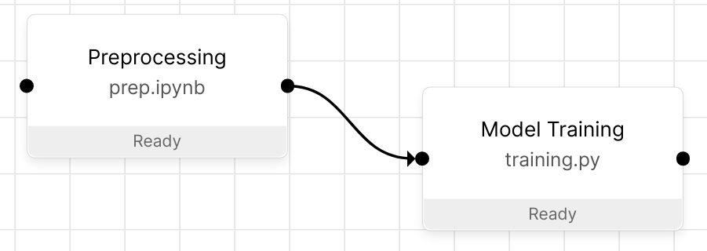

.. _how orchest works:

How Orchest works
=================
.. note::
   WIP (Should be readable for engineers and non-technical people)!
   Notion that Orchest's views are just views on top of the project directory that lives on the
   filesystem.

A pipeline in Orchest can be thought of as a graph, where the nodes are executable files that
execute within their own isolated environment (powered by containerization), and the edges define
the execution order and the way the data flows. All built in our visual pipeline editor.

Orchest is a fully containerized application and its runtime can be managed through the ``orchest``
shell script. Orchest runs in kubernetes and the script will take care of deploying the
application in the cluster.

The mental model in Orchest is centered around *Projects*. Within each project you get to create
multiple :ref:`pipelines <pipeline>` through the Orchest UI, and every pipeline consists of
:ref:`pipeline steps <pipeline step>` that point to your scripts. Let's take a look at the
following directory structure of a project:

.. code-block:: bash

    myproject
        ├── .orchest
        │   ├── pipelines/
        │   └── environments/
        ├── pipeline.orchest
        ├── prep.ipynb
        └── training.py

.. note::
   Orchest creates a ``.orchest/`` directory to store state. In the ``.orchest/pipelines/``
   directory the passed data between steps is stored (per pipeline in ``data/``), if disk based data
   passing is used instead of (the default) memory data passing, see :ref:`data passing <data
   passing>`. Per pipeline (inside ``.orchest/pipelines/``) there is also a ``logs/`` directory
   containing the STDOUT of the scripts, the STDOUT can be inspected through the Orchest UI.

.. tip::
   You should not put large files inside your project, instead, you should write data to the special
   ``/data`` directory. The ``/data`` directory is shared between projects.  :ref:`Jobs <jobs>`
   creates snapshots of the project directory (for reproducibility reasons) and therefore would copy
   all the data.

The :ref:`pipeline definition <pipeline definition>` file ``pipeline.orchest`` in the directory
structure above defines the structure of the pipeline. For example:

As you can see the pipeline steps point to the corresponding files: ``prep.ipynb`` and
``training.py``. These files are run inside their own isolated environments (as defined in
``.orchest/environments/``) using containerization.  In order to install additional packages or to
easily change the Docker image, see :ref:`environments <environments>`.

Concepts
--------
At Orchest we believe that Jupyter Notebooks thank their popularity to their interactive nature. It
is great to get immediate feedback and actively inspect your results without having to run the
entire script.

To facilitate a similar workflow within Orchest both JupyterLab and :ref:`interactive pipeline runs
<interactive pipeline run>` get to directly change your notebook files. Lets explain this with an
example. Assume your pipeline is just a single ``.ipynb`` file (run inside its own environment) with
the following code:

.. code-block:: python

   print("Hello World!")

If you now, without having executed this cell in JupyterLab, go to the pipeline editor, select the
step and press *Run selected steps* then you will see in JupyterLab that the cell has outputted
``"Hello World!"`` without having run it in JupyterLab.

.. note::
   Even though both interactive pipeline runs and JupyterLab change your files, they do not share
   the same kernel! They do of course share the same environment.

.. tip::
   Make sure to save your notebooks before running an interactive pipeline run, otherwise JupyterLab
   will prompt you with a "File Changed" pop-up whether you want to "Overwrite" or "Revert" on the
   next save. "Overwrite" would let you keep the changes, however, it would then overwrite the
   changes made by the interactive run.

Appendix
--------

``userdir/`` paths
~~~~~~~~~~~~~~~~~~
Overview of the different paths inside the ``userdir/``.

.. code-block:: bash

   .
   ├── data/
   ├── jobs
   │   └── <project-uuid>
   │       └── <pipeline-uuid>
   │           └── <job-uuid>
   │               ├── <noninteractive-run-uuid>
   │               │   └── <copy-myproject-state-after-job>
   │               └── snapshot
   │                   └── <complete-copy-of-myproject>
   ├── .orchest
   │   ├── user-configurations
   │   │   └── jupyterlab
   │   │       └── <various configuration files>
   │   ├── database
   │   │   └── data
   │   │       └── <postgres data store>
   │   ├── buildkit-cache
   │   ├── jupyter-img-builds
   │   ├── env-img-builds
   │   ├── orchest_examples_data.json
   │   ├── orchest_update_info.json
   │   ├── celery-*.db (different celery dbs)
   │   └── kernels
   │       └── <project-uuid>
   │           ├── launch_kubernetes.py
   │           └── orchest-env-<project-uuid>-<env-uuid>
   │               └── kernel.json
   └── projects
       └── myproject
           ├── mypipe.orchest
           ├── .orchest
           │   ├── pipelines
           │   │   └── <pipeline-uuid>
           │   │       ├── logs
           │   │       │   └── <pipeline-step-uuid>.log
           │   │       │   └── <service-name>.log
           │   │       └── data
           │   │           ├── <pipeline-step-uuid>.<serialization>
           │   │           └── HEAD
           │   ├── environments
           │   │   └── <env-uuid>
           │   │       ├── properties.json
           │   │       └── setup_script.sh
           │   └── .gitignore
           └── preprocessing.ipynb

.. _pipeline-json-schema:

Pipeline definition JSON
~~~~~~~~~~~~~~~~~~~~~~~~

The full `JSON Schema <https://json-schema.org/>`_ definition of :ref:`pipelines <pipeline
definition>` in Orchest can be found below.

You can see an example and interactive validator `here <https://www.jsonschemavalidator.net/s/FfQDko01>`_.

Check out an example `pipeline.orchest` file in our `Quickstart repo <https://github.com/orchest/quickstart/blob/main/california_housing.orchest>`_.

Full JSON Schema:

.. code-block:: json

  {
    "$id": "http://orchest.io/schemas/pipeline/1.0.0.json",
    "$schema": "http://json-schema.org/schema#",
    "definitions": {
      "parameter": {
        "propertyNames": {
          "type": "string"
        },
        "type": "object"
      },
      "uuidv4": {
        "pattern": "^[0-9a-f]{8}-[0-9a-f]{4}-4[0-9a-f]{3}-[89ab][0-9a-f]{3}-[0-9a-f]{12}$",
        "type": "string"
      }
    },
    "properties": {
      "name": {
        "type": "string"
      },
      "parameters": {
        "$ref": "#/definitions/parameter"
      },
      "settings": {
        "properties": {
          "auto_eviction": {
            "type": "boolean"
          },
          "data_passing_memory_size": {
            "type": "string"
          }
        },
        "type": "object"
      },
      "steps": {
        "additionalProperties": false,
        "patternProperties": {
          "": {
            "properties": {
              "environment": {
                "$ref": "#/definitions/uuidv4"
              },
              "file_path": {
                "type": "string"
              },
              "incoming_connections": {
                "items": {
                  "$ref": "#/definitions/uuidv4"
                },
                "type": "array"
              },
              "kernel": {
                "properties": {
                  "display_name": {
                    "type": "string"
                  },
                  "name": {
                    "type": "string"
                  }
                },
                "required": [
                  "display_name",
                  "name"
                ],
                "type": "object"
              },
              "meta_data": {
                "properties": {
                  "hidden": {
                    "type": "boolean"
                  },
                  "position": {
                    "items": {
                      "type": "number"
                    },
                    "type": "array"
                  }
                },
                "type": "object"
              },
              "parameters": {
                "$ref": "#/definitions/parameter"
              },
              "title": {
                "type": "string"
              },
              "uuid": {
                "$ref": "#/definitions/uuidv4"
              }
            },
            "required": [
              "uuid",
              "title",
              "parameters",
              "kernel",
              "incoming_connections",
              "file_path",
              "environment"
            ],
            "type": "object"
          }
        },
        "propertyNames": {
          "$ref": "#/definitions/uuidv4"
        },
        "type": "object"
      },
      "services": {
        "additionalProperties": false,
        "patternProperties": {
          "": {
            "additionalProperties": false,
            "properties": {
              "image": {
                "type": "string"
              },
              "name": {
                "type": "string"
              },
              "command": {
                "type": "string"
              },
              "args": {
                "type": "string"
              },
              "scope": {
                "items": {
                  "type": "string"
                },
                "type": "array"
              },
              "binds": {
                "properties": {
                  "": {
                    "type": "string"
                  }
                },
                "type": "object"
              },
              "env_variables": {
                "properties": {
                  "": {
                    "type": "string"
                  }
                },
                "type": "object"
              },
              "env_variables_inherit": {
                "items": {
                  "type": "string"
                },
                "type": "array"
              },
              "exposed": {
                "type": "boolean"
              }
              "ports": {
                "items": {
                  "type": [
                    "string",
                    "number"
                  ]
                },
                "type": "array"
              },
              "preserve_base_path": {
                "type": "boolean"
              },
              "requires_authentication": {
                "type": "boolean"
              }
            },
            "required": [
              "image",
              "name",
              "scope"
            ],
            "type": "object"
          }
        },
        "propertyNames": {
          "type": "string"
        },
        "type": "object"
      },
      "uuid": {
        "$ref": "#/definitions/uuidv4"
      },
      "version": {
        "type": "string"
      }
    },
    "required": [
      "name",
      "settings",
      "steps",
      "version"
    ],
    "type": "object"
  }

ENV variables
~~~~~~~~~~~~~
When it comes to pipeline execution, each pipeline step is executed in its own environment. More
particularly in its own container. Depending on how the code inside a pipeline step is executed a
number of ENV variables are set by Orchest. The different ways to execute code as part of a pipeline
step are:

* Running the cell of a Jupyter Notebook in JupyterLab,
* Running an interactive run through the pipeline editor,
* Running a non-interactive run as part of a job.

In all of the above mentioned cases the following ENV variables set: ``ORCHEST_PROJECT_UUID``,
``ORCHEST_PIPELINE_UUID`` and ``ORCHEST_PIPELINE_PATH``. Then there is ``ORCHEST_STEP_UUID``, which is
used for data passing, this ENV variable is always present in (non-)interactive runs and in the
Jupyter Notebooks after the first data passing using the :ref:`Orchest SDK`. Additionally, you can
use the following code snippet to get the UUID of the step if it is not yet set inside the
environment:

.. code-block:: python

    import json
    import orchest

    # Put in the relative path to the pipeline file.
    with open("pipeline.orchest", "r") as f:
        desc = json.load(f)

    p = orchest.pipeline.Pipeline.from_json(desc)
    step_uuid = orchest.utils.get_step_uuid(p)

Lastly, there are ``ORCHEST_MEMORY_EVICTION`` and ``ORCHEST_PROJECT_DIR``. The former is never
present when running notebooks interactively and otherwise always present, this means eviction of
objects from memory can never be triggered when running notebooks interactively. The latter is used
to make the entire project directory available through the JupyterLab UI and is thus only set for
interactive Jupyter kernels.

SDK data passing
~~~~~~~~~~~~~~~~
The :meth:`orchest.transfer.get_inputs` method calls :meth:`orchest.transfer.resolve` which, in
order to resolve what output data the user most likely wants to get, needs a timestamp of the most
recent output for every transfer type. E.g. if some step outputs to disk at 1pm and later outputs to
memory at 2pm, then it is very likely that output data should be retrieved from memory. Therefore,
we adhere to a certain "protocol" for transfers through disk and memory as can be read below.

Disk transfer
"""""""""""""
To be able to resolve the timestamp of the most recent write, we keep a file called ``HEAD`` for
every step. It has the following content: ``timestamp, serialization``, where timestamp is specified
in isoformat with timespec in seconds.

Memory transfer
"""""""""""""""
When data is put inside the store it is given metadata stating either its serialization or (in case
of an empty message for eviction) the source and target of the output that is stored.

All metadata has to be in `bytes`, where we use the following encoding:

* ``1;serialization`` where serialization is one of ``["arrow", "arrowpickle"]``.
* ``2;source,target`` where source and target are both UUIDs of the respective steps.
