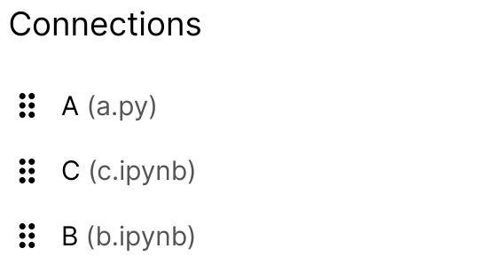

.. _data passing:

Data passing
============
.. tip::
   👉 Check out the full :ref:`data passing API reference <api transfer>`.

To pass data between the different pipeline steps, across different languages, we make use of the
`Apache Arrow <https://github.com/apache/arrow>`_ project. The :ref:`Orchest SDK` provides a
convenience wrapper of the project to be used within Orchest.

We will start with an example to illustrate how to pass data between pipeline steps before diving
into more detail.

Python example
--------------
.. note::
   💡 Orchest also supports data passing for other languages than Python. For example, check out
   the :ref:`Orchest SDK` section on :ref:`R <r>`.

.. The SDK manages the target and source of the data, leaving you only with the decision what data to
.. pass. The target and source of the data are inferred through the :ref:`pipeline definition <pipeline
.. definition>`.

In this example we will use Python to illustrate how to pass data between different pipeline steps.
Let the pipeline be defined as follows:

.. figure:: ../img/pipeline.png
   :width: 400
   :alt: Pipeline defined as: step-1, step-2 --> step-3
   :align: center

   An example pipeline.

In both steps 1 and 2 we will create some data and pass it to step 3 under specific names so that we
can later use those names to get the data.

.. code-block:: python

   """step-1"""
   import orchest

   data = "Hello, World!"

   # Output the data so that step-3 can retrieve it.
   orchest.output(data, name="my_string")

.. code-block:: python

   """step-2"""
   import orchest

   data = [3, 1, 4]

   # Output the data so that step-3 can retrieve it.
   orchest.output(data, name="my_list")

When outputting the data in steps 1 and 2 the data is actually copied to another location in shared
memory so that other steps can access it. This explains why you can access the data from inside
JupyterLab as well!

Now that data is in memory, step-3 can be executed and get the data for further processing.

.. code-block:: python

   """step-3"""
   import orchest

   # Get the input for step-3, i.e. the output of step-1 and step-2.
   input_data = orchest.get_inputs()

.. warning::
   🚨 Only call :meth:`orchest.transfer.get_inputs` and :meth:`orchest.transfer.output` once.
   Otherwise your code will break in :ref:`jobs <jobs>` and cause data to get overwritten
   respectively.

The ``input_data`` in step-3 will be as follows:

.. code-block:: json

   {
    "my_list": [3, 1, 4],
    "my_string": "Hello, World!",
    "unnamed": []
   }

You can see both ``my_string`` and ``my_list``, the output data from steps 1 and 2 respectively, are
in the received input data. But what is the ``unnamed``? We will answer this in the next section.

Passing data without a name
---------------------------
As you could see in the previous example, step-3 received input data with a special key called
``unnamed``. When passing data it is not necessary to give the data you are outputting a name, for
example we could change what step-1 is outputting:

.. code-block:: python

   """step-1"""
   import orchest

   data = "Hello, World!"

   # Output the data so that step-3 can retrieve it.
   # But this time, don't give a name.
   orchest.output(data, name=None)

The ``input_data`` in step-3 will now be equal to:

.. code-block:: json

   {
    "my_list": [3, 1, 4],
    "unnamed": ["Hello, World!"]
   }

Populating the list of the ``unnamed`` key with the values of the steps that outputted data without
a name.

For example, we could change the code of step-2 to:

.. code-block:: python

   """step-2"""
   import orchest

   data = [3, 1, 4]

   orchest.output(data, name=None)

Making the ``input_data`` in step-3 equal to:

.. code-block:: json

   {
    "unnamed": ["Hello, World!", [3, 1, 4]]
   }

But how exactly is this useful?

By outputting data without a name the receiving step can treat the values as a collection (it is
even an ordered collection, see :ref:`order of unnamed data <unnamed order>`). Just like in regular programming,
sometimes you would rather use a list than a dictionary to store your data.

.. tip::
   👉 For the majority of cases passing data with a name is the way to go!

.. _unnamed order:

Order of unnamed data
~~~~~~~~~~~~~~~~~~~~~
.. note::
   💡 :meth:`orchet.transfer.get_inputs` actually infers the order via the pipeline definition. The
   UI simply stores the order in the pipeline definition file and provides a visual handle to it.

The image below is a screenshot from the properties pane in the UI of step-3 from the example above.
The order of the list in the screenshot can be changed with a simple drag and drop.

Having the above order of connections, the ``input_data`` in step-3 becomes (note how the order of
the data in ``unnamed`` has changed!):

.. code-block:: json

   {
    "unnamed": [[3, 1, 4], "Hello, World!"]
   }

Top-to-bottom in the UI corresponds with left-to-right in ``unnamed``.
