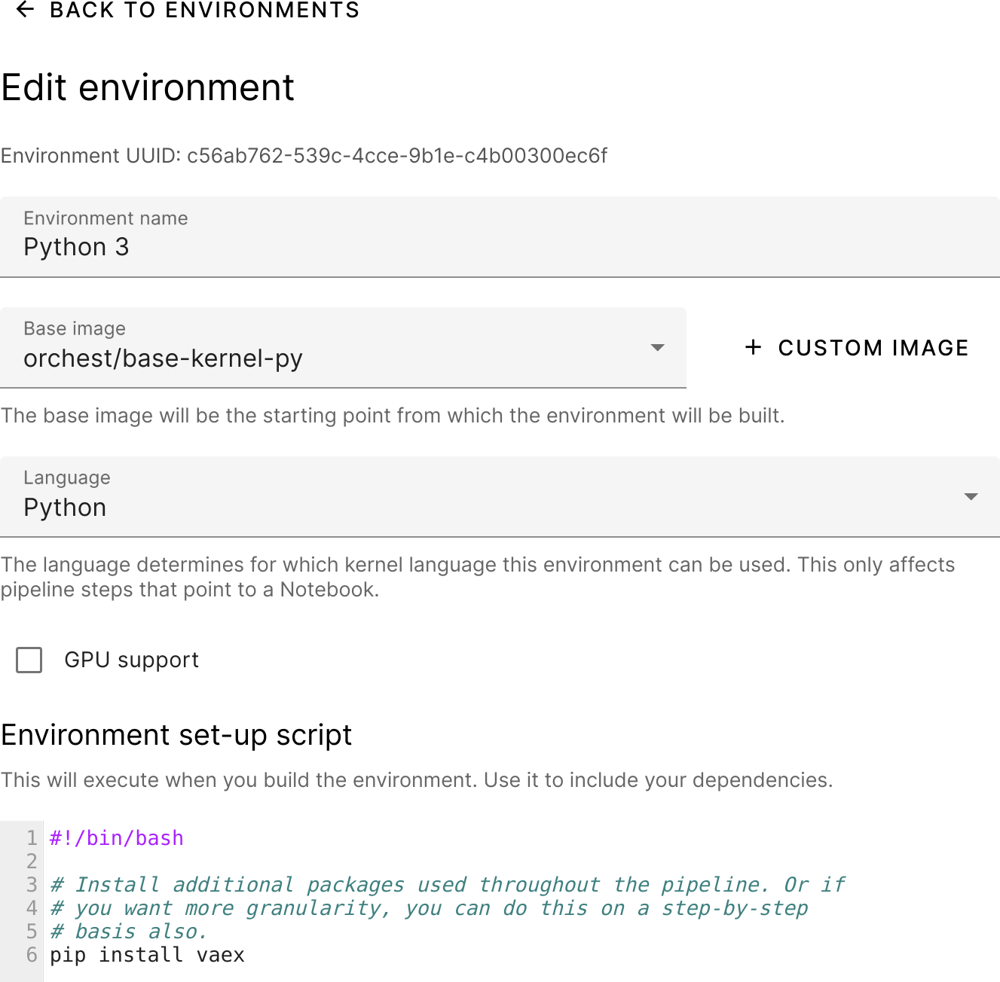
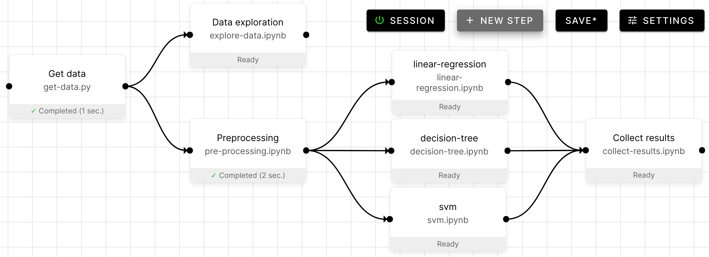
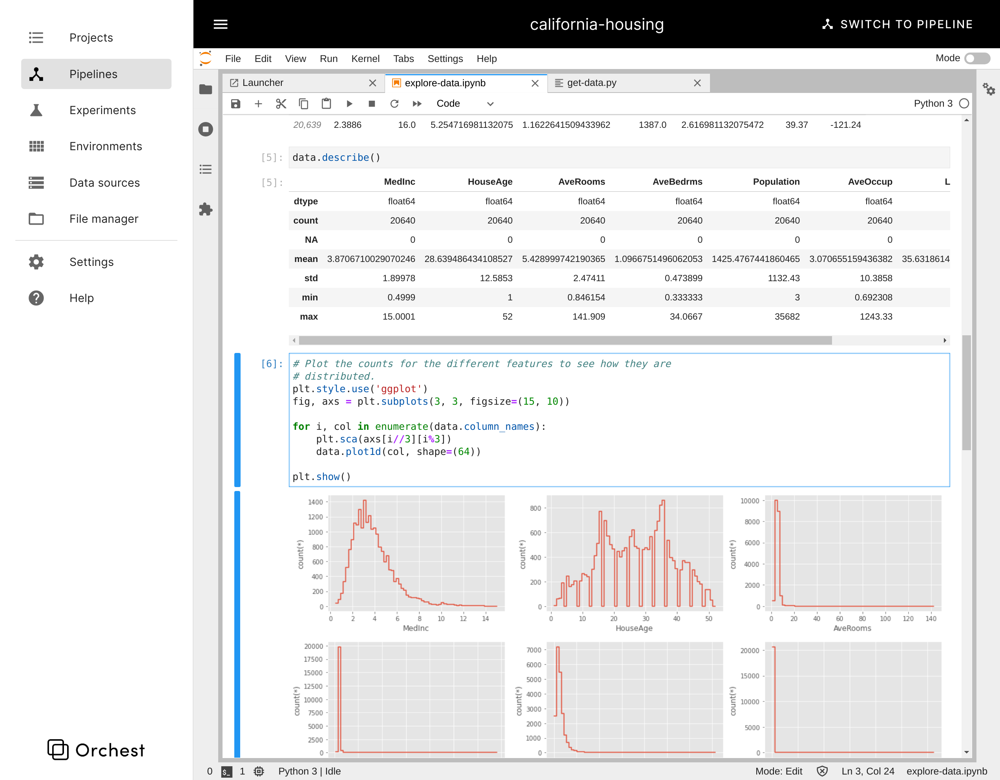
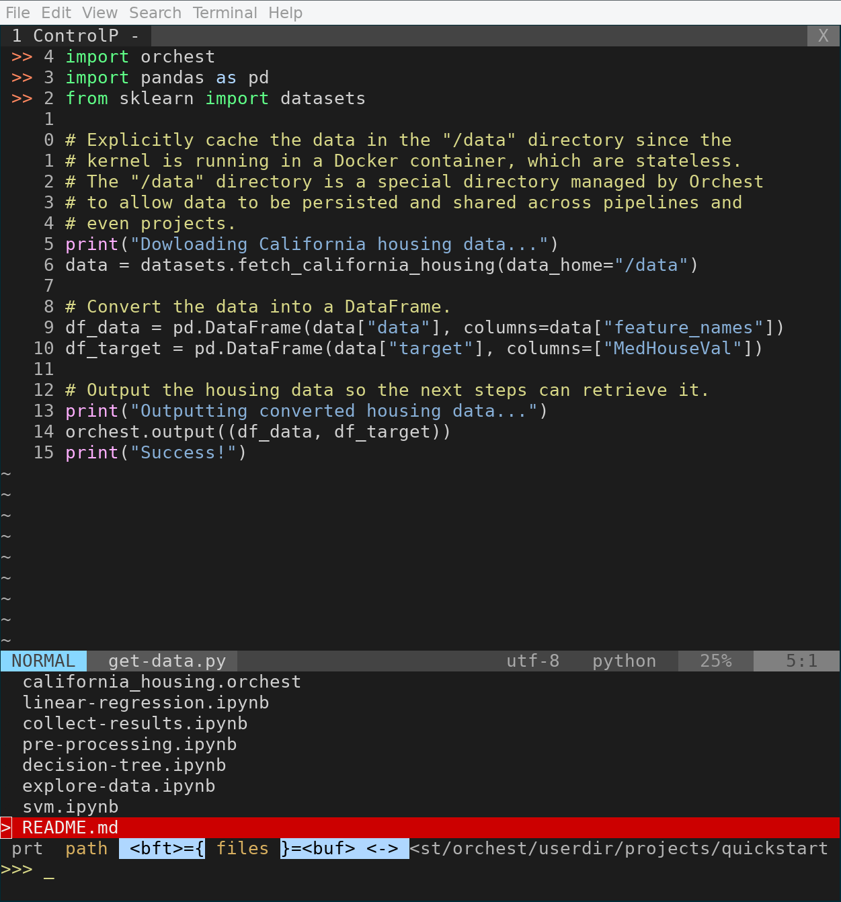
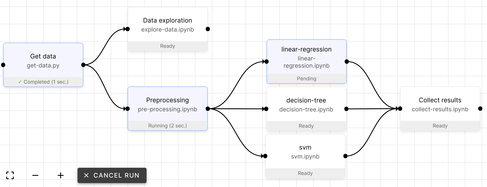
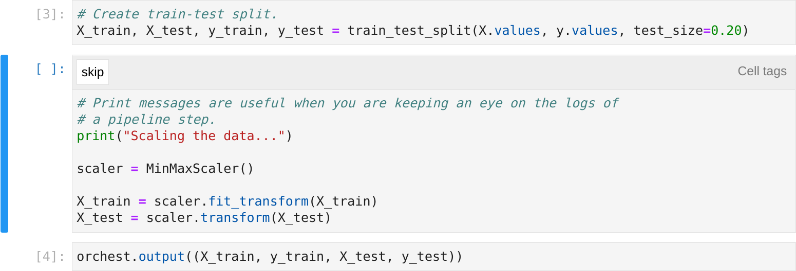
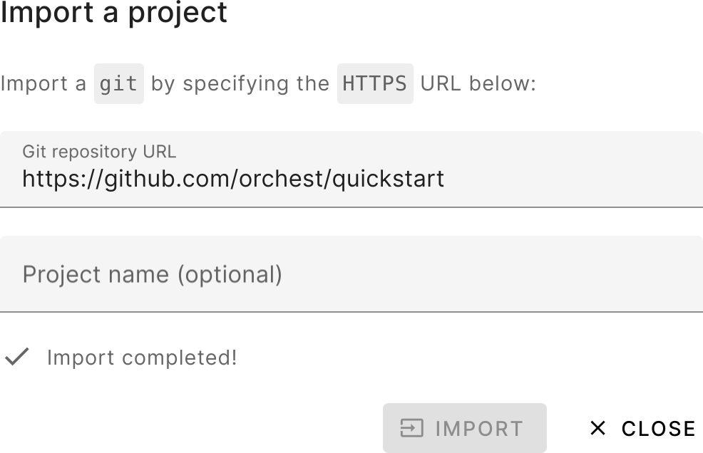

.. _overview:

Overview
========

With Orchest you get to:

* :ref:`Easily define your custom runtime environment <custom runtime environment>`.
* :ref:`Visually construct pipelines <visually construct>`.
* :ref:`Write code using JupyterLab <edit with jupyterlab>`.
* :ref:`Write code using any other editor of choice <edit with vim>`.
* :ref:`Run any subset of a pipeline <run any subset>`.
* :ref:`Skip certain cells when executing a notebook top-to-bottom <skip cells>`.
* :ref:`Parametrize your data science pipelines to try out different modeling ideas
  <parametrize pipelines>`.
* :ref:`Define environment variables at the project or pipeline level
  <env variables>`.
* :ref:`Version your pipelines through git <version through git>`.

.. _custom runtime environment:

Easily define your custom runtime environment
---------------------------------------------

.. _visually construct:

Visually construct pipelines
----------------------------

.. _edit with jupyterlab:

Write code using JupyterLab
---------------------------

.. _edit with vim:

Write code using any other editor of choice
-------------------------------------------

.. _run any subset:

Run any subset of a pipeline
----------------------------

.. _skip cells:

Skip certain cells when executing a notebook
--------------------------------------------

.. _parametrize pipelines:

Parametrize your data science pipelines
---------------------------------------
.. figure:: ../img/overview/parametrize.png
   :width: 300
   :align: center

.. _env variables:

Define environment variables at the project or pipeline level
--------------------------------------------------------------
.. figure:: ../img/overview/parametrize.png
   :width: 300
   :align: center

.. _version through git:

Version your pipelines through git
----------------------------------

