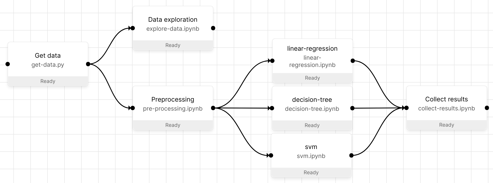
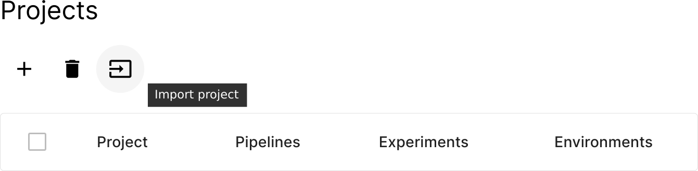
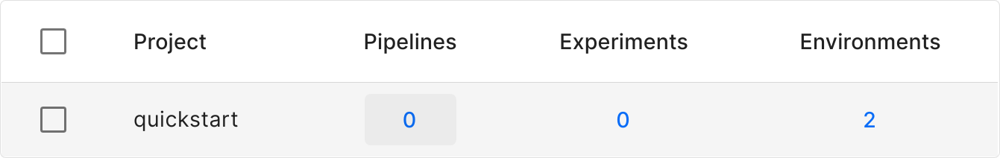
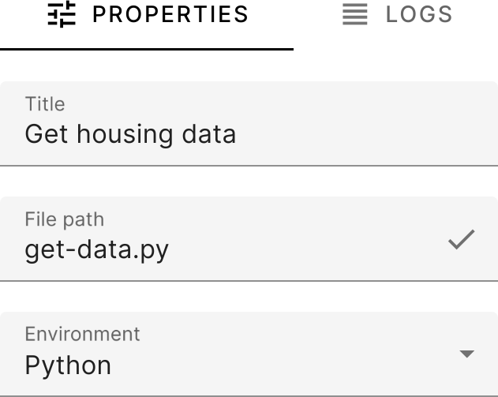
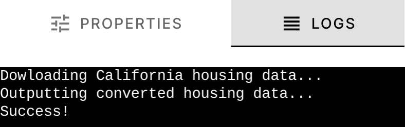
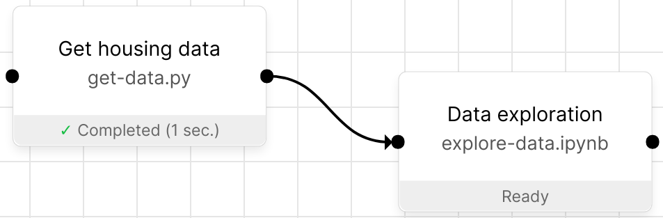
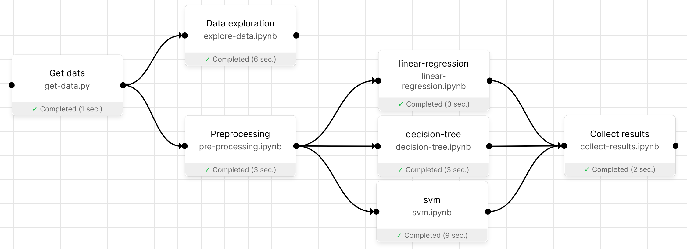

.. _quickstart:

Quickstart tutorial
===================

.. tip::
   👉 Building data pipelines in Orchest is really that easy! Check out our `introductory video
   <https://vimeo.com/589879082>`_.

This quickstart will follow an example explaining how to build data science pipelines in Orchest and
touches upon some core principles that will be helpful when you get to building your own pipelines.
The example pipeline will download the `sklearn California housing dataset
<https://scikit-learn.org/stable/modules/generated/sklearn.datasets.fetch_california_housing.html>`_, explore the
data, train some classifiers, and in the final step collect the results from those classifiers.

   The resulting pipeline from this quickstart.

.. _impatient:

For the impatient
-----------------
As `Miguel Grinberg <https://blog.miguelgrinberg.com/index>`_ would say: "If you are the instant
gratification type, and the screenshot at the top of this article intrigued you, then head over to
the `Github repository <https://github.com/orchest/quickstart>`_ for the code used in this article.
Then come back to learn how everything works!"

To get started in Orchest you can import the GitHub repository URL
``https://github.com/orchest/quickstart`` through the UI:

Your first project
------------------
To start, make sure you have :ref:`installed Orchest <regular installation>` and started it:

.. code-block:: bash

   # Make sure to be in the root-level orchest directory.
   orchest start

Next create a new :ref:`project <projects>` named ``quickstart``. After creating the project, you will see that it
does not yet have any :ref:`pipelines <pipeline>`.

.. note::
   All code in this quickstart is written in Python, nevertheless, we do also support other
   languages such as R.

Get California housing data
---------------------------
The logical next step is to create the first pipeline called ``California housing`` and open the
pipeline editor. This will automatically boot an :ref:`interactive session <interactive session>` so
you can interactively edit the Python script we create (the other steps will be Jupyter Notebooks!):

1. Create a new step by clicking: *+ new step*.
2. Enter a *Title* and *File path*, respectively ``Get housing data`` and ``get-data.py``.

.. note::
   The changes you make to the pipeline (through the pipeline editor) are saved automatically.

Now we can start writing our code through the familiar JupyterLab interface, simply press *edit in
JupyterLab* (making sure you have the step selected) and paste in the following code:

.. code-block:: python
   :linenos:
   :emphasize-lines: 11, 19

   import orchest
   import pandas as pd
   from sklearn import datasets

   # Explicitly cache the data in the "/data" directory since the
   # kernel is running in a Docker container, which are stateless.
   # The "/data" directory is a special directory managed by Orchest
   # to allow data to be persisted and shared across pipelines and
   # even projects.
   print("Dowloading California housing data...")
   data = datasets.fetch_california_housing(data_home="/data")

   # Convert the data into a DataFrame.
   df_data = pd.DataFrame(data["data"], columns=data["feature_names"])
   df_target = pd.DataFrame(data["target"], columns=["MedHouseVal"])

   # Output the housing data so the next steps can retrieve it.
   print("Outputting converted housing data...")
   orchest.output((df_data, df_target), name="data")
   print("Success!")

As you can see, we have highlighted a few lines in the code to emphasize important nuts and bolts to
get a better understanding of building pipelines in Orchest. These nuts and bolts are explained
below:

    First we start with explaining line ``11`` in which we cache the data in the ``/data``
    directory.  This is actually the ``userdir/data`` directory (from the Orchest GitHub repository)
    that gets bind mounted in the respective Docker container running your code.  This allows you to
    access the data from any pipeline, even from pipelines in different projects. Data should be
    stored in ``/data`` not only for sharing purposes, but also to make sure that :ref:`jobs
    <jobs>` do not unnecessarily copy the data when creating the snapshot for reprodicibility
    reasons.

    Secondly, line ``19`` showcases the usage of the :ref:`Orchest SDK <orchest sdk>` to :ref:`pass
    data between pipeline steps <data passing>`. Keep in mind that calling
    :meth:`orchest.transfer.output` multiple times will result in the data getting overwritten, in
    other words: only output data once per step!

To run the code, switch back to the pipeline editor, select the step and press *run selected steps*.
After just a few seconds you should see that the step completed successfully. Let's check the logs
to confirm - the logs contain the latest STDOUT of the script.

Remember that running the code will output the converted housing data, so in the next step we can
now retrieve and explore that data!

Data exploration
----------------
Now that we have downloaded the data, the next pipeline step can explore it. Create another pipeline
step with *Title* ``Data exploration`` and *File path* ``explore-data.ipynb``, and connect the two
pipeline steps.

You can get the code for this pipeline step from the ``explore-data.ipynb`` `file in the GitHub
repository <https://github.com/orchest/quickstart/blob/main/explore-data.ipynb>`_.

Maybe you already noticed the imports in the previous step:

.. code-block:: python

   import orchest
   import pandas as pd
   from sklearn import datasets

These dependencies are satisfied by default, because the :ref:`environments <environments>`
are based on the `Jupyter Docker Stacks <https://jupyter-docker-stacks.readthedocs.io/en/latest/>`_
which come pre-installed with common data science packages.

.. note::
   Adding additional dependencies (even system level dependencies) can be done by using
   :ref:`environments <environments>`.

Finalizing the pipeline
-----------------------
To end up with the final pipeline, please refer to the :ref:`For the impatient <impatient>` section
to import the pipeline. You can also build the pipeline from scratch yourself!

   A successful pipeline run of the final pipeline.

.. note::
   The :ref:`interactive session <interactive session>` does not shut down automatically and thus the
   resources will keep running when editing another pipeline, you can shut down the session manually
   by clicking on the shut down button. Of course all resources are shut down when you shut down
   Orchest with ``orchest stop``.
