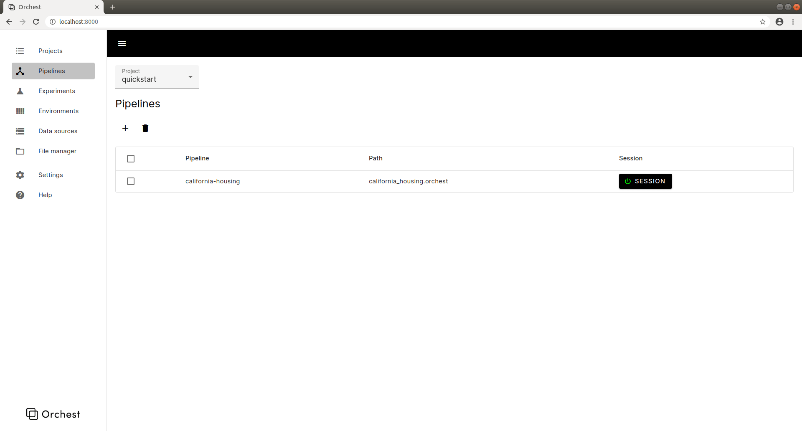
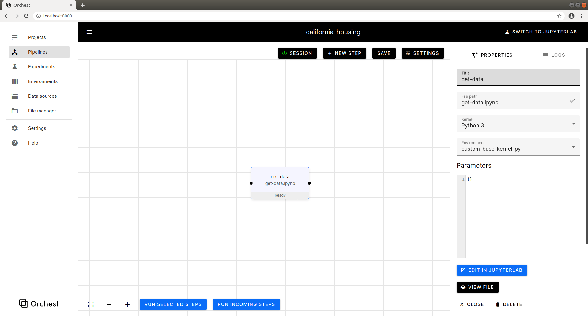
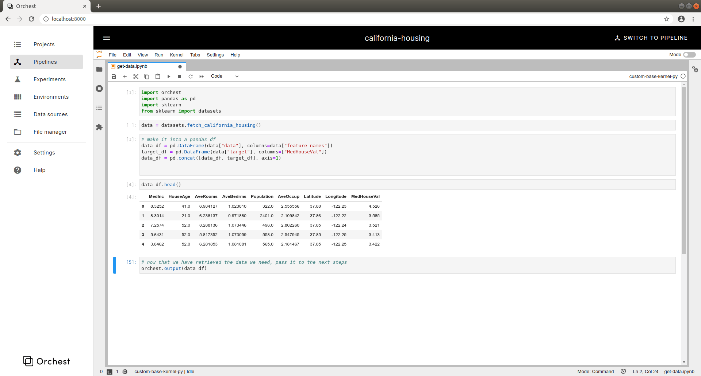
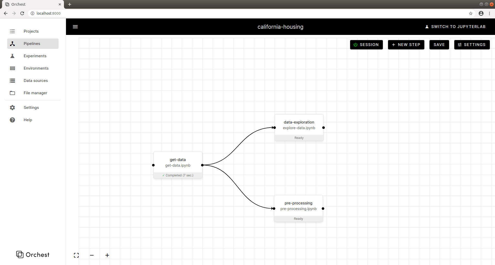
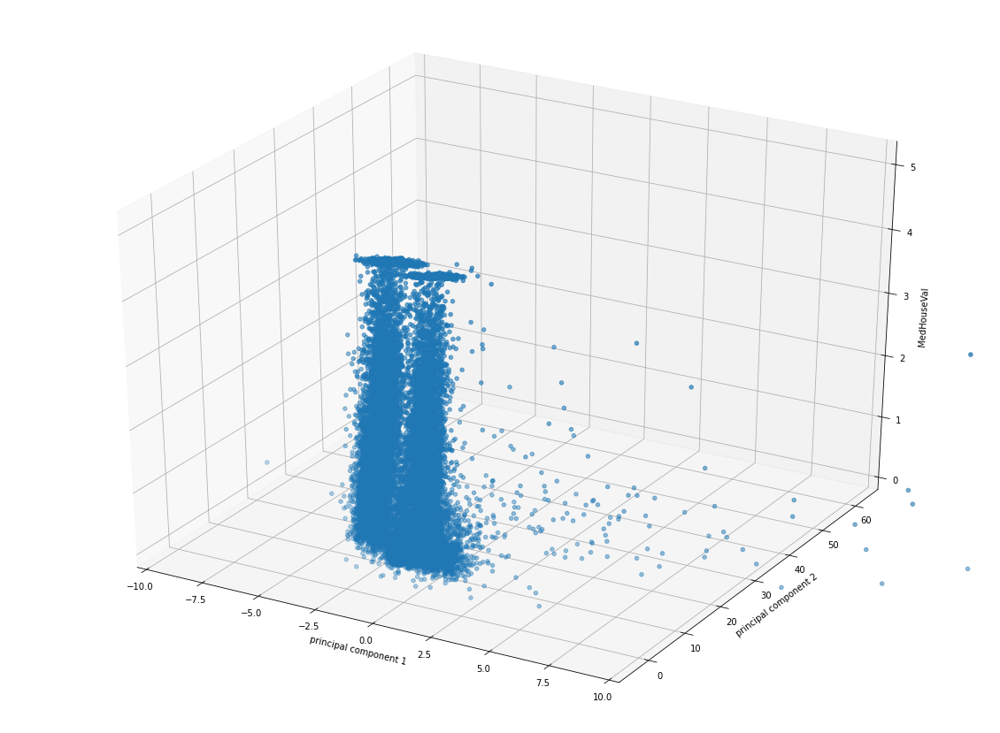
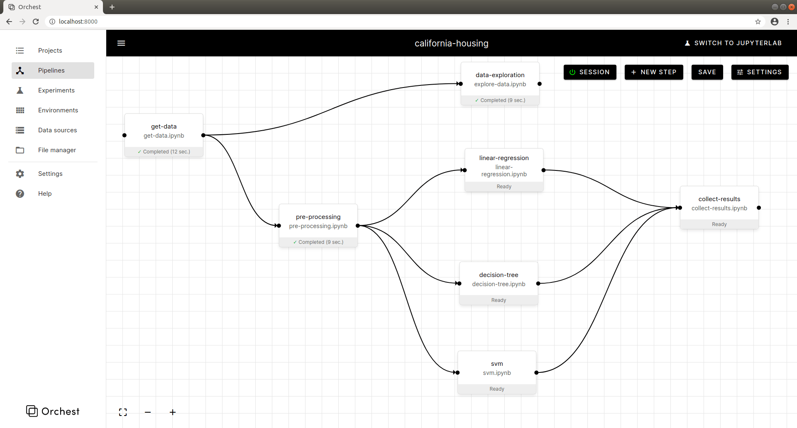

Quickstart
==========

General workflow in Orchest
---------------------------

1. *Build your pipeline*. Visually build your pipeline: create, drag and connect steps.

2. *Write your code*. Use your editor of choice or use the integrated JupyterLab environment in
   Orchest.

3. *Run your pipeline*. Happy with your implementation? Go back to the pipeline view and run your
   pipeline.

4. *Check your output*. This can be done either through the "logs" view or directly inside your
   notebook.

Your first project
------------------
We will go through an example project showing you how to build a pipeline in Orchest.  

Launch Orchest:

.. code-block:: bash

   ./orchest start

To follow along, you can import the `complete example project <https://github.com/orchest/quickstart>`_ 
by going to *Projects* and using the *Import project* button.  
Otherwise, create a new project. Go to the *Projects* view and press on the *Add project* button.

If you decided to go for a new project, note that it has no pipelines. Go to the *Pipelines* view and create a pipeline.

Click on the pipeline and get to the pipeline view. As you enter
the view, a dedicated session for your pipeline will boot up, allowing
you to edit and run your notebooks in real time.

Let's create a simple pipeline in charge of downloading some data,
processing it and training some classifiers.
Begin by clicking on the *NEW STEP* button.
Choose a name for the step, along with a file. Since you are working
in a newly created project, you will have to create a new file, for example, 
a notebook.

Edit the step by clicking on *EDIT IN JUPYTERLAB*, let's get
a toy dataset to play with.

  .. code-block:: python

    import orchest
    import pandas as pd
    import sklearn
    from sklearn import datasets

    data = datasets.fetch_california_housing()

    # make it into a pandas df
    data_df = pd.DataFrame(data["data"], columns=data["feature_names"])
    target_df = pd.DataFrame(data["target"], columns=["MedHouseVal"])
    data_df = pd.concat([data_df, target_df], axis=1)

    data_df.head()

    # now that we have retrieved the data we need, pass it to the next steps
    orchest.output(data_df)

Your notebook should look similar to this

Now that we have a step which takes care of pulling in data, let's create
new steps to make use of it.
Connect the data import step to the new ones using your mouse.

As before, get into JupyterLab. Make use of your data through the orchest SDK.
As long as you have run the first step at least once, its data will be available
to the steps making use of it, so that you can easily iterate on the steps
of your pipeline.

  .. code-block:: python

    import orchest
    # get data from all previous steps, in our case, a single one
    data = orchest.get_inputs()
    data = data[0]

A data exploration step could make use of libraries such as 
`matplotlib <https://matplotlib.org/>`_ to gain insights.

While a processing step might prepare the data for further use.

  .. code-block:: python

   import orchest
   from sklearn.pipeline import Pipeline
   from sklearn.preprocessing import MinMaxScaler
   from sklearn.model_selection import train_test_split

   # get the data from the previous step
   data = orchest.get_inputs()
   data = data[0]

   sklearn_pipeline = Pipeline([
        ('min_max_scaler', MinMaxScaler()),
    ])

   #### Process the data and make it available to the next steps
   X = data[data.columns[:-1]].values
   y = data[[data.columns[-1]]].values
   X_train, X_test, y_train, y_test = train_test_split(X, y, test_size=0.20, 
      random_state=42)
   X_train = sklearn_pipeline.fit_transform(X_train)
   X_test = sklearn_pipeline.transform(X_test)

   orchest.output((X_train, y_train, X_test, y_test))

The processed data can now be used by different classifiers, which
result will later be collected by a final step. You can check its
output through the logs of the step or in JupyterLab.

