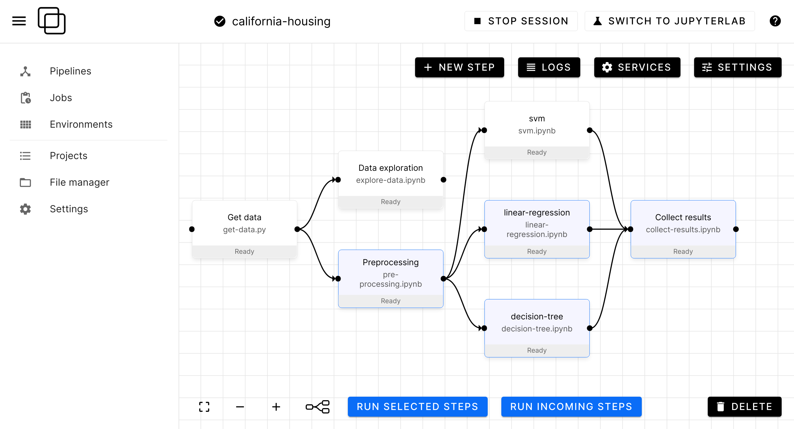

Orchest
=======

.. title:: Orchest Docs

.. tip::
   👉 Get started with the :ref:`quickstart <quickstart>`!

   💡 Watch the `video <https://vimeo.com/589879082>`_ to learn more.

**Orchest is a tool for building data pipelines, made to be easy to use.**

* Visually construct pipelines through our user-friendly UI
* Code in Notebooks and scripts (:ref:`quickstart <quickstart>`)
* Run any subset of a pipelines directly or periodically (:ref:`jobs <jobs>`)
* Easily define your dependencies to run on any machine (:ref:`environments <environments>`)
* Spin up services whose lifetime spans across the entire pipeline run (:ref:`services <services>`)
* Version your projects using git (:ref:`projects <projects>`)

.. toctree::
   :maxdepth: 1
   :hidden:
   :caption: Getting started

   getting_started/installation
   getting_started/quickstart
   getting_started/when_to_use_orchest
   getting_started/how_to

.. toctree::
   :maxdepth: 1
   :hidden:
   :caption: Fundamentals

   fundamentals/projects
   fundamentals/pipelines
   fundamentals/data_passing
   fundamentals/jobs
   fundamentals/environments
   fundamentals/environment_variables
   fundamentals/services
   fundamentals/sdk/index
   fundamentals/configuration
   fundamentals/glossary

.. toctree::
   :maxdepth: 1
   :hidden:
   :caption: Development

   development/contributing
   development/development_workflow
   development/how_orchest_works
   development/troubleshooting
   development/implementation_best_practices
