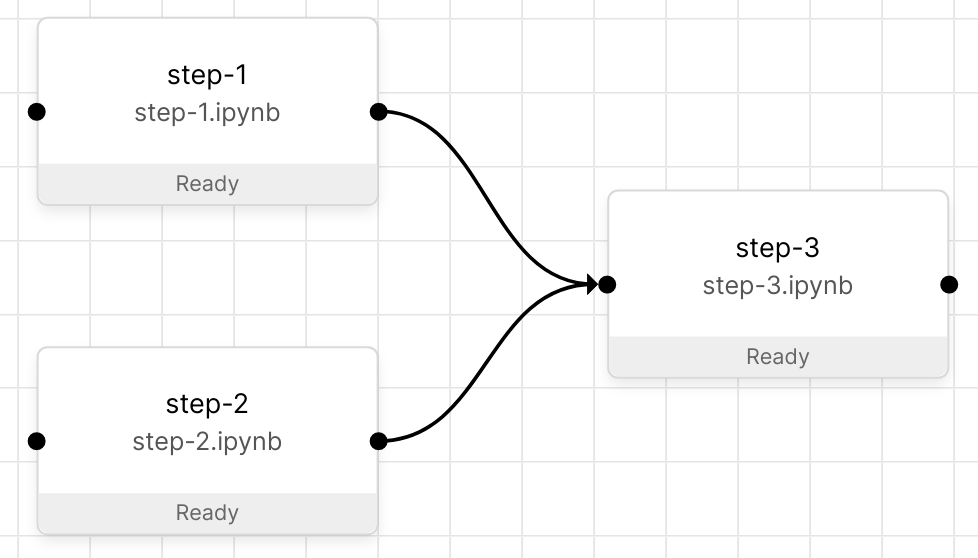

Python
======

Quickstart
----------

.. _sdk-quickstart-data-passing:

Data passing
~~~~~~~~~~~~
The SDK manages the target and source of the data, leaving you only with the decision what data to
pass. The target and source of the data are inferred through the :ref:`pipeline definition <pipeline
definition>`.

For this example we let the pipeline be defined as follows:

.. note::
   In this example we will name the data we output in the steps. It is also possible to use
   ``name=None`` and obtain the data using the ``"unnamed"`` key, which allows you treat the inputs
   as a collection. Additionally, there is an implied order of data in ``"unnamed"``, for more
   information please read the dedicated :ref:`connections section <connections>`.

.. code-block:: python

   """step-1"""
   import orchest

   data = "Hello, World!"

   # Output the data so that step-3 can retrieve it.
   orchest.output(data, name="my_string")

.. code-block:: python

   """step-2"""
   import orchest

   data = [3, 1, 4]

   # Output the data so that step-3 can retrieve it.
   orchest.output(data, name="my_list")

.. code-block:: python

   """step-3"""
   import orchest

   # Get the input for step-3, i.e. the output of step-1 and step-2.
   input_data = orchest.get_inputs()

   print(input_data)
   # {
   #  "my_list": [3, 1, 4],
   #  "my_string": "Hello, World!"
   # }

.. note::
   Memory eviction of objects is disabled by default, refer to :ref:`configuration <configuration>`
   to learn how to enable it.

.. _sdk-quickstart-parameters:

Parameters
~~~~~~~~~~
.. code-block:: python

   import orchest

   # Get the parameters of the current step and the pipeline.
   fruit = orchest.get_step_param("fruit") # e.g. "apple"
   vegetable = orchest.get_pipeline_param("vegetable") # e.g. "carrot"

   # Update the step parameter. The updated parameter will be
   # visible in the GUI, in the properties pane of the step.
   fruit = "kiwi"
   orchest.update_step_param("fruit", fruit)

.. note::
   Parameters are at the core of :ref:`jobs <jobs>`, giving a handle to try out different modeling
   ideas based on a set of variable inputs.

API
---

orchest.transfer
~~~~~~~~~~~~~~~~

.. automodule:: orchest.transfer
    :members:

orchest.parameters
~~~~~~~~~~~~~~~~~~

.. automodule:: orchest.parameters
    :members:

orchest.services
~~~~~~~~~~~~~~~~~~

.. automodule:: orchest.services
    :members:
