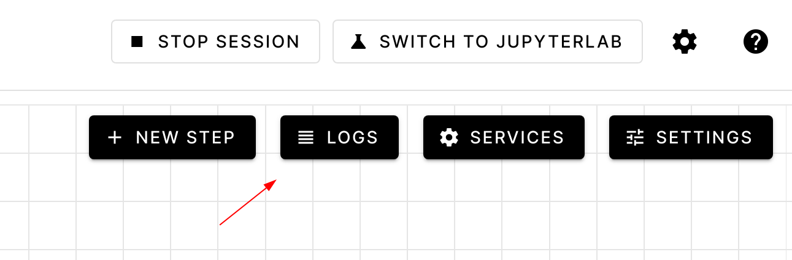
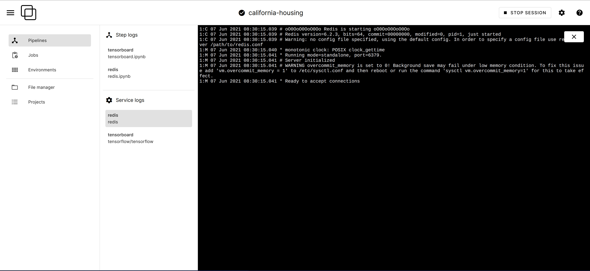

.. _Services:

========
Services
========

What's a service in Orchest?
============================

Services within Orchest allow you to run a **database**, **Redis** instance, **Tensorboard** or
another "service" together with your pipeline, with a **lifetime that spans across the entire
session**. These services can persist to disk and can be configured to be reachable from your
browser.

To add a service to your Orchest pipeline, go to the `pipeline settings` and check out the
`services` tab.

.. _Ready to go templates:

Ready to go templates
=====================
For ease of use, we provide some commonly used services as templates:

.. figure:: ../img/overview/services.png
   :width: 400
   :align: center

Tensorboard, Streamlit and VSCode are set up to be reachable from your browser, the link will be
available both in the pipeline editor under `services` and in the service configuration settings.
Postgres and Redis will only be reachable from within Orchest, i.e. from pipeline steps, notebooks
and other services.

After adding Redis or Postgres as services, you can use the following snippets of code to verify
connectivity.

Redis
-----

Assumes ``redis-py`` has been installed in the environment used by the step,
e.g. ``pip install redis``, see the :ref:`environments <environments>` section.

.. code-block:: python

   import orchest
   import redis

   redis_host = orchest.get_service("redis")["internal_hostname"]
   redis_client = redis.Redis(host=redis_host, port=6379, db=0)
   redis_client.set("hello", "there")
   redis_client.get("hello")

Postgres
--------

Assumes ``psycopg2`` has been installed in the environment used by the step, e.g. ``pip install
psycopg2-binary``.

.. code-block:: python

   import orchest
   import psycopg2

   postgres_host = orchest.get_service("postgres")["internal_hostname"]
   conn = psycopg2.connect(dbname="postgres", user="postgres", host=postgres_host)
   cur = conn.cursor()
   cur.execute("CREATE TABLE test (id serial PRIMARY KEY, num integer, data varchar);")
   cur.execute("INSERT INTO test (num, data) VALUES (%s, %s)", (1337, "hello"))
   cur.execute("SELECT * FROM test;")
   cur.fetchone()

.. _Logs:

Logs
====

You can keep track of all your services (and steps) logs through the `LOGS` button in the pipeline
editor.

.. _The details:

The details
===========

After going to `pipeline settings` > `services` > `add service`, you will
have the option to create a custom service, where you can pin down your specs.

.. tip::
   The service templates can serve as a starting point, be sure to check them out!

Required fields:

- **name**: The name of the server.
- **image**: The image to use for the service.

Non required fields:

- **command**: Service start command, e.g. what process the service will run.
- **entrypoint**: `command` and `entrypoint` are a 1:1 mapping to Docker, refer to the `Docker docs
  <https://docs.docker.com/engine/reference/builder/#cmd>`_ for their difference and gotchas.
- **environment variables**: Key-value pairs of environment variables. While project and
  pipeline environment variables are considered as `secrets`, services environment variables
  aren't and will be persisted in the pipeline definition file.
- **inherited environment variables**: A list of environment variable names that will be inherited
  from the project and pipeline environment variables, and from job environment variables when run
  in a job. These variables take priority over the service environment variables in case of name
  collisions.
- **scope**: Specifies whether the service should be running in interactive mode, jobs, or both.
- **project directory mount**: To bind a service file system path to the directory of the project.
  This will allow the service to read or write to the project directory. See the VS-Code template
  for an example.
- **data directory mount**: To bind a service file system path to the Orchest ``/data`` directory.
- **ports**: The ports that the service will be listening on when it comes to external connectivity.
  You don't have to add any port if you are only interested in a service being reachable by
  Notebooks and pipeline steps, which we refer to as internal connectivity. A service that has
  defined ports will be reachable from outside of Orchest through a special URL, **on all ports**.
  Currently, only the `http` protocol is supported. The URL(s) through which you can connect to an
  externally reachable service is shown in the service settings and the pipeline editor, through the
  `SERVICES` button.
- **preserve base path**: Some applications use relative paths when it comes to handling URLS, e.g.
  for web page assets such as images, javascript code, and CSS.  Others will expect the base path to
  be preserved when being proxied. The need for toggling this is based on the specific application
  at hand, and it's only of interest for external connectivity.

  .. figure:: ../img/services-pointer.png
    :width: 600
    :align: center

.. tip::
  Most services that run some sort of server are already set to bind to the required interfaces to
  expose said server. This might not be always the case and so you have to explicitly set it while
  changing the **command**. The way bindings are set is application dependant, for example,
  `Tensorboard` provides the flag ``--bind_all`` to bind on all interfaces.

Permissions of files written by a service
-----------------------------------------

If you make use of the project or data directory mounts, you need make sure that data is written
with the correct permissions. This can be done by changing the ``umask`` of the container process.

Let's take, for example, the `Tensorboard` template. Normally, the command would look like
``tensorboard --logdir /data --bind_all`` but this would cause issues with file permissions on the
host. In the `Tensorboard` template we solve this as follows:

- setting the entrypoint as ``bash``
- setting the service command as ``-c 'umask 002 && tensorboard --logdir /data --bind_all'``

.. _Orchest environments as services:

Orchest environments as services
================================

It might be the case that a predefined image from DockerHub does not cover your needs. For example,
you might need to install an additional package or set some configuration files. That is why we
allow a service to be defined by an Orchest environment. This way you can iterate on and customize
any service without the burden of interacting with Docker or pushing to an image repository.
Everything can be done through the easy interface of Orchest.

See the :ref:`environments <environments>` section for details on how to build an environment.
